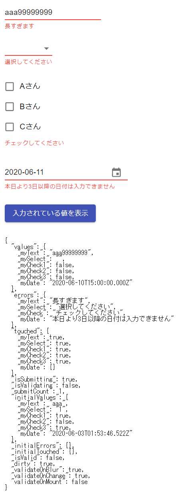
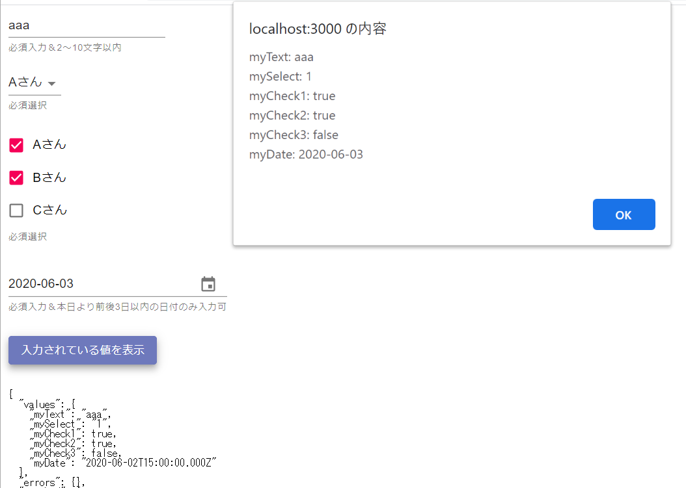

# sample-formik-02-materialui
formikのサンプル（MaterialUI利用）

## インストール

```
> yarn add formik
> yarn add yup
> yarn add @material-ui/core

以下は datepicker を利用するために必要
> yarn add @date-io/date-fns@1.x
> yarn add date-fns
> yarn add @material-ui/pickers
> yarn add @material-ui/icons
```

## GitHub

■Formik  
https://github.com/jaredpalmer/formik

■yup（Formik公式推奨のバリデーション実装ライブラリ）  
https://github.com/jquense/yup

## WebSite

■Formik  
https://jaredpalmer.com/formik/

## 画面イメージ

  


## 備考

- DateTimePickerとFormikの連携にはすこしクセがあるが、連携できないわけではなさそう
